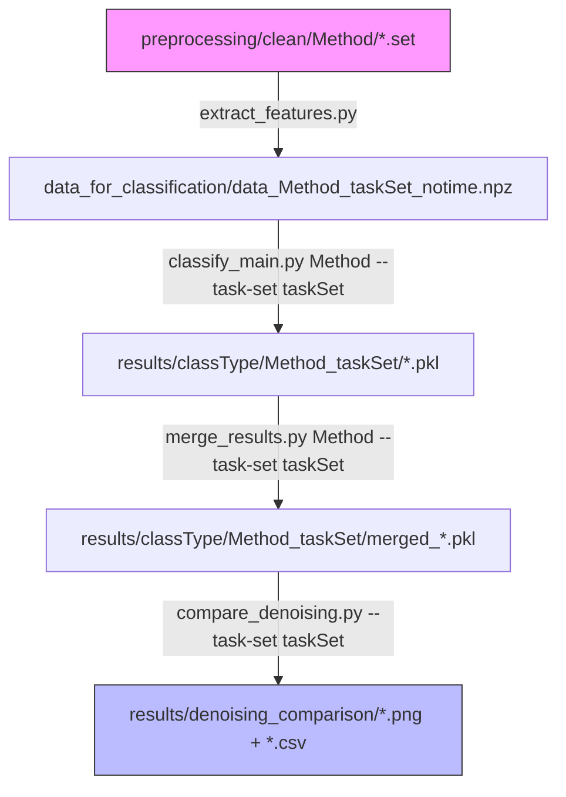

# AMBER ERP Classification Pipeline

Classification framework for Event-Related Potential (ERP) analysis of the **AMBER EEG dataset**, comparing classification performance across five EEG denoising methods.

Adapted from the [VEP_classification_comp](https://github.com/ninaomejc/VEP_classification_comp) codebase (Omejc et al., 2023), rewritten as a unified Python pipeline for the AMBER dataset.

## Reference Dataset

**AMBER: Advancing Multimodal Brain-Computer Interfaces for Enhanced Robustness — A Dataset for Naturalistic Settings**

> Awais, M. A., Redmond, P., Ward, T. E., & Healy, G. (2024). AMBER: advancing multimodal brain-computer interfaces for enhanced robustness—A dataset for naturalistic settings. *Frontiers in Neuroergonomics*, 5, 1216440. https://doi.org/10.3389/fnrgo.2024.1216440

The AMBER dataset was recorded at Dublin City University (DCU) with approval from the DCU Research Ethics Committee (DCUREC/2021/175). Ten healthy participants (6 male, 4 female, aged 20–35) each completed 4 sessions. EEG was acquired with a 32-channel ANT-Neuro eego sports system (10-20 montage, CPz online reference, 1 kHz sampling, 500 Hz lowpass), and video was captured simultaneously via a Logitech C920 webcam (20 fps).

### Experimental Paradigm

Participants performed a Rapid Serial Visual Presentation (RSVP) image-search task: images were presented at 4 Hz, and participants covertly counted occurrences of a known target category (e.g., cars). Each 90-s block contained 360 trials (36 target / 324 standard; 10% target rate).

The dataset includes three categories of recordings:

| Task ID | Description | Duration | Trials per session |
|---------|-------------|----------|---------------------|
| B0 | Baseline — Eyes open | 10 s | — |
| B1 | Baseline — Eyes movement | 60 s | — |
| B2 | Baseline — Eyes closed | 60 s | — |
| **X1** | **Standard RSVP** | 90 s | 360 (36 rare / 324 frequent) |
| **X2** | **Standard RSVP** | 90 s | 360 (36 rare / 324 frequent) |
| X3 | Artifact only — Body movement | 90 s | — |
| **X4** | **RSVP + Body movement** | 90 s | 360 (36 rare / 324 frequent) |
| X5 | Artifact only — Talking | 90 s | — |
| **X6** | **RSVP + Talking** | 90 s | 360 (36 rare / 324 frequent) |
| X7 | Artifact only — Head movement | 90 s | — |
| **X8** | **RSVP + Head movement** | 90 s | 360 (36 rare / 324 frequent) |

- **Standard RSVP** (X1, X2): Participants perform the RSVP task while sitting still.
- **Artifact RSVP** (X4, X6, X8): Participants perform the RSVP task while simultaneously producing body movement, talking, or head movement artifacts.
- **Artifact-only** (X3, X5, X7): Participants produce artifacts without performing the RSVP task (not used in classification).

This pipeline uses only the RSVP tasks (X1, X2, X4, X6, X8) that contain both frequent and rare stimulus events.

### Denoising Methods

| Method | Description |
|--------|-------------|
| **RAW** | No ICA-based denoising (baseline) |
| **ASR** | Artifact Subspace Reconstruction |
| **ICLabel** | ICLabel-based artifact removal |
| **MARA** | Multiple Artifact Removal Algorithm |
| **GEDAI** | GEDAI v1.7 plugin-based artifact removal |

## Overview

This pipeline extracts features from the cleaned EEG data and evaluates multiple classifiers to assess how denoising choice affects downstream classification accuracy. It was adapted from the VEP_classification_comp codebase (Omejc et al., 2023) and rewritten as a unified Python framework for the AMBER dataset.

### Classification Algorithms

Nine classifiers are evaluated:

| Classifier | Implementation |
|-----------|---------------|
| LDA | `LinearDiscriminantAnalysis` |
| KNN (k=3) | `KNeighborsClassifier` |
| LR | `LogisticRegression` (balanced class weights) |
| Decision Tree | `DecisionTreeClassifier` |
| AdaBoost | `AdaBoostClassifier` (100 estimators) |
| XGBoost | `XGBClassifier` (gbtree, max_depth=4) |
| Random Forest | `RandomForestClassifier` (100 estimators, balanced) |
| SVC (linear) | `SVC(kernel='linear')` |
| SVC (RBF) | `SVC(kernel='rbf')` |

### Classification Tasks

- **bysub** — Classify rare vs. frequent per subject (2-class)
- **allsubs** — Classify rare vs. frequent across all subjects (2-class)
- **bytask** — Classify stimulus × task type across subjects (4-class: frequent_standard, rare_standard, frequent_artifact, rare_artifact)

### Recording Selection

The pipeline supports selecting which RSVP recordings to include in classification:

| Recording group | Tasks | Description |
|----------------|-------|-------------|
| `standard` | X1, X2 | RSVP without artifact production |
| `artifact` | X4, X6, X8 | RSVP with concurrent artifact production |
| `all` | X1, X2, X4, X6, X8 | All RSVP tasks (default) |

For finer control, individual artifact conditions can be specified:

```bash
# Standard RSVP only
python run_all_denoising.py --recordings standard

# All artifact RSVP (X4, X6, X8)
python run_all_denoising.py --recordings artifact

# Artifact RSVP — body movement only (X4)
python run_all_denoising.py --recordings artifact --artifact-conditions X4

# Artifact RSVP — body movement + talking (X4, X6)
python run_all_denoising.py --recordings artifact --artifact-conditions X4 X6

# Standard + specific artifact conditions
python run_all_denoising.py --recordings standard artifact --artifact-conditions X4 X6

# Individual task codes
python run_all_denoising.py --recordings X1 X4 X8
```

The recording selection produces a **task-set identifier** embedded in output filenames and directories:

| Recording selection | task_id | Example filenames (RAW, stat) |
|---|---|---|
| All (default) | `all` | `data_raw_notime.npz`, `results/bysub_notime/raw/` |
| Standard only | `standard` | `data_raw_standard_notime.npz`, `results/bysub_notime/raw_standard/` |
| Artifact only | `artifact` | `data_raw_artifact_notime.npz`, `results/bysub_notime/raw_artifact/` |
| X4, X6 | `artX4X6` | `data_raw_artX4X6_notime.npz`, `results/bysub_notime/raw_artX4X6/` |
| X1, X2, X4 | `std_artX4` | `data_raw_std_artX4_notime.npz`, `results/bysub_notime/raw_std_artX4/` |

> **Note:** The `bytask` classification requires both standard and artifact recordings. If you select only standard or only artifact recordings, `bytask` will produce a warning since it degenerates to a 2-class problem equivalent to `allsubs`.

### Feature Types

1. **Statistical ERP parameters** (`_notime`): Peak amplitude (PA), mean amplitude (MA), peak latency (PL), and fractional latency (FL) extracted from four ERP components (P1, N1, P2, P3) over occipital and central electrode clusters.
2. **Temporal features** (`""`): Amplitude and ERSP time-frequency features at each time point across electrode clusters (occipital, parietal, central, frontal).

## Project Structure

```
classification/
├── README.md                        # This file
├── requirements.yaml                # Conda environment (amberClass)
├── config.py                        # Central configuration
├── extract_features.py              # Feature extraction (replaces MATLAB)
├── classify_main.py                 # Main classification entry point
├── classify_bysub.py               # Per-subject classification
├── classify_allsubs.py             # All-subjects classification
├── merge_results.py                 # Merge per-classifier results
├── compare_denoising.py            # Cross-method comparison & statistics
├── run_all_denoising.py            # Orchestration script
├── utils.py                         # Utility & plotting functions
├── data_for_classification/         # Extracted feature files (.npz)
└── results/                          # Classification results
```

## Pipeline



### Step 1 — Feature Extraction (Python)

Unlike the original VEP pipeline that required MATLAB + EEGLAB, feature extraction is now done entirely in Python using MNE:

```bash
# Extract statistical ERP parameters for a single method (all tasks)
python extract_features.py RAW --feature-type stat

# Extract both feature types for all methods
python extract_features.py all --feature-type both

# Extract only for specific RSVP tasks
python extract_features.py RAW --feature-type stat --tasks X1 X2

# Use recording group shorthand
python extract_features.py RAW --feature-type stat --recordings standard
python extract_features.py RAW --feature-type stat --recordings artifact --artifact-conditions X4 X6
```

Each produces `.npz` files in `data_for_classification/` named with the task-set identifier.

### Step 2 — Classification (Python)

Classify a single denoising method:

```bash
python classify_main.py RAW
python classify_main.py ASR --classification bysub_notime
python classify_main.py ICLabel --classification allsubs_notime --task-set standard
```

### Step 3 — Merge Results

```bash
python merge_results.py RAW --task-set standard
```

### Step 4 — Compare Denoising Methods

```bash
python compare_denoising.py --task-set standard
```

This generates:
- Grouped bar plot: AUROC by classifier for each denoising method
- Heatmap: AUROC (method × classifier)
- Average AUROC across classifiers per method
- Statistical comparisons (paired t-tests with Bonferroni correction)

### Quick Start (Full Pipeline)

```bash
# Complete pipeline: extract → classify → merge → compare
python run_all_denoising.py

# Standard RSVP only
python run_all_denoising.py --recordings standard

# Artifact RSVP with specific conditions
python run_all_denoising.py --recordings artifact --artifact-conditions X4 X6

# Skip extraction (use existing features)
python run_all_denoising.py --skip-extract

# Skip classification, only merge and compare
python run_all_denoising.py --skip-extract --skip-classify
```

## Methodology

### Feature Extraction

1. Cleaned `.set` files are loaded using MNE-Python.
2. Events are extracted from annotations (frequent/rare stimuli).
3. Epochs are created around stimulus onset (−200 ms to 1000 ms).
4. Trials with amplitude exceeding ±100 µV at relevant electrode clusters are rejected.
5. Subjects with fewer than 50 good trials are excluded.
6. For statistical features: PA, MA, PL, FL are extracted from P1, N1, P2, P3 components.
7. For temporal features: Amplitude and ERSP are computed per electrode cluster at each time point.

### Classification Protocol

- **Cross-validation**: 10-fold stratified cross-validation (`StratifiedKFold`).
- **Class balancing**: SMOTE oversampling combined with random undersampling.
- **Normalisation**: Min-max scaling fitted on training data only (no data leakage).
- **NaN handling**: Median imputation from training data.
- **Metrics**: Accuracy, balanced accuracy, AUROC, precision, recall, F1 score.
- **Feature importance**: Permutation importance (accuracy, balanced accuracy, AUROC) and mutual information.

## Key Differences from VEP_classification_comp

| Aspect | VEP_classification_comp | AMBER Classification |
|--------|------------------------|---------------------|
| **Feature extraction** | MATLAB + EEGLAB | Python (MNE) |
| **Data format** | `.mat` (MATLAB) | `.npz` (NumPy) |
| **Age groups** | Young vs. Older | N/A (single group) |
| **Classification tasks** | bysub, allsubs, allsubsage | bysub, allsubs, bytask |
| **Dataset** | Visual oddball (aging study) | RSVP + artifact production |
| **Subjects** | 70 (young + older) | 10 (healthy, 20–35 years) |
| **Naming convention** | `G*_ar.set` | `P*-Ss*-X*-eeg_*.set` |
| **Recording selection** | All tasks | Selectable (standard/artifact/all) |

## Dependencies

### Python

Install via conda:

```bash
conda env create -f requirements.yaml
conda activate amberClass
```

Key packages: `numpy`, `pandas`, `scikit-learn`, `imbalanced-learn`, `xgboost`, `matplotlib`, `seaborn`, `scipy`, `mne`, `networkx`.

## Citation

If you use this code, please cite both the AMBER dataset and the original classification methodology:

> Awais, M. A., Redmond, P., Ward, T. E., & Healy, G. (2024). AMBER: advancing multimodal brain-computer interfaces for enhanced robustness—A dataset for naturalistic settings. *Frontiers in Neuroergonomics*, 5, 1216440. https://doi.org/10.3389/fnrgo.2024.1216440

> Omejc, N., Redmond, P., Ward, T. E., & Healy, G. (2023). On the influence of aging on classification performance in visual EEG oddball paradigm using statistical and temporal features. *Frontiers in Neuroscience*, 17, 1216440.

## License

This code is released under the same license as the AMBER dataset. The AMBER dataset is distributed under the Creative Commons Attribution License (CC BY), as described in the original publication.
